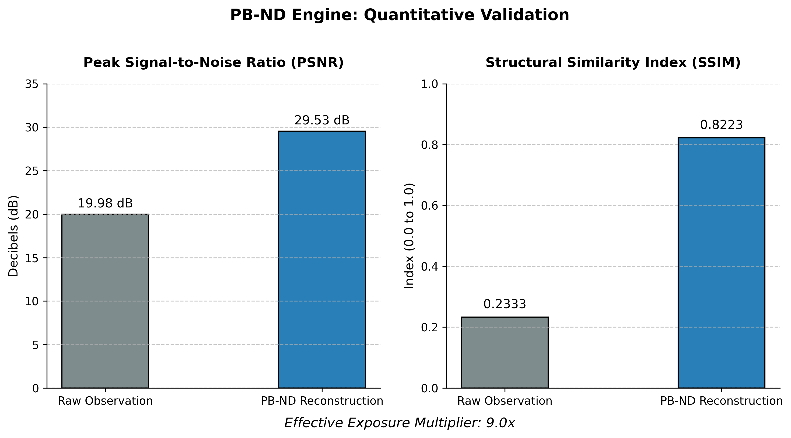

# PB-ND: Physics-Informed Neural Deconvolution
**Reversing Atmospheric Turbulence and Photon Noise in Deep-Space Telemetry**

PB-ND is a custom, lightweight Physics-Informed Neural Network (PINN) designed to process raw, photon-starved astronomical data. By embedding physical optical equations directly into the AI's loss function, this engine mathematically reverses point-spread function (PSF) blurring and Poisson noise without hallucinating structures.

*Left: Raw JWST FITS mosaic (Orion Bar). Right: PB-ND AI Reconstruction.*

## Key Features
* **Physics-Informed Loss Engine:** Utilises an $L_1$ + MSE hybrid loss paired with $PSF$ wavelength convolution to ensure the AI obeys the physical laws of diffraction.
* **Hyperspectral Calibration:** Custom loaders handle percentile Z-scaling and Inverse Hyperbolic Sine (`arcsinh`) stretching for extreme-dynamic-range JWST infrared data.
* **Sliding Window Mosaicking:** Capable of deconvolving multi-gigapixel, multi-gigabyte FITS files on a standard CPU by intelligently chunking, cleaning, and seamlessly stitching the data.

## Quantitative Benchmarks
Using the SSIM (Structural Similarity Index) and PSNR metrics against controlled synthetic data, the PB-ND engine achieves a massive leap in signal clarity. 
* **Effective Exposure Multiplier: 9.0x** * A 45-second observation cleaned by PB-ND contains the signal clarity of a 6.8-minute continuous exposure.

## Tech Stack
* **Core:** Python, PyTorch (Neural Networks)
* **Astrophysics:** Astropy, Numpy (FITS file parsing and tensor manipulation)
* **Vision:** Matplotlib, Scikit-Image (Metrics and Visualization)

## The Architecture
The core model is a modified U-Net optimised for memory efficiency. Instead of standard "image enhancement," the network operates purely on normalised photon counts. The `PhysicsInformedLossRGB` class dynamically masks saturated star cores (to prevent gradient explosions) while heavily penalising the network for violating local structural similarities in the dim nebula gas.
